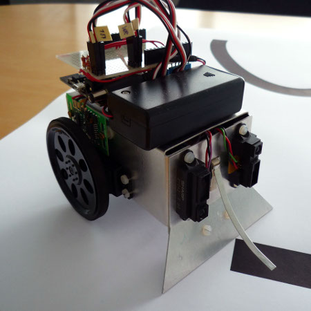

# Line Follower Robot

## BRANCH INFO
This branch is used for the Maestro paper. Ask Casper at casper.thule@eng.au.dk for more information.

## Overview
This example was originally developed in the DESTECS project. The model simulates a robot that can follow a line painted on the ground. The line contrasts from the background and the robot uses a number of sensors to detect light and dark areas on the ground. The robot has two wheels, each powered by individual motors to enable the robot to make controlled changes in direction. The number and position of the sensors may be configured in the model. A controller takes input from the sensors and encoders from the wheels to make outputs to the motors.

The robot moves through a number of phases as it follows a line. At the start of each line is a specific pattern that will be known in advance. Once a genuine line is detected on the ground, the robot follows it until it detects that the end of the line has been reached, when it should go to an idle state.

## Supported Features
This study supports the following INTO-CPS technologies:

* Multi-CT model
* 20-Sim (for FMU)
* OpenModelica (for FMU)
* VDM-RT (for FMU)
* INTO-CPS SysML  
* Co-simulation Engine (COE)
* Design Space Exploration
* Test Automation
* Model Checking
* Code Generation

## Additional Information
Additional Information about this case study can be found in the [Examples Compendium](http://projects.au.dk/fileadmin/D3.5_Examples_Compendium_2.pdf#page=34)

Alternatively, contact the case study owner, [Carl Gamble](mailto:carl.gamble@ncl.ac.uk).
